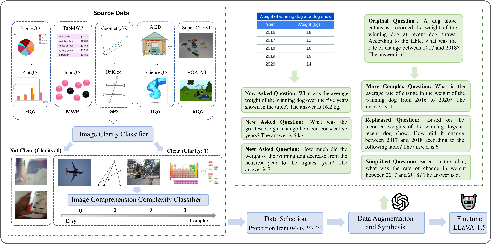

# Math-LLaVA

This repository contains the code, data and model for the paper titled "Math-LLaVA: Bootstrapping Mathematical Reasoning for Multimodal Large Language Models".

[Paper](http://arxiv.org/abs/2406.17294), [Dataset-MathV360K](), [Model](https://huggingface.co/Zhiqiang007/Math-LLaVA/tree/main)



## Install Packages
```
cd Math-LLaVA
conda create -n math_llava python=3.10 -y
conda activate math_llava
pip install -e .
```
## Enable Deepspeed and Flash-attention
```
pip install -e ".[train]"
pip install flash-attn --no-build-isolation
```

## Data Preparation
Download our [dataset]().

Place the data in the root directory or other directory.
Data structure:
```
├── images_data/
│   ├── TabMWP/images/
│   ├── IconQA/images/
│   ├── ...
├── train_samples_all_tuning.json
```
"train_samples_all_tuning.json" corresponds to the training set of MathV360K. 

## run full-finetuning
```
sh finetune_task.sh
```

## MathVista Evaluation
You can download and unzip images of MathVista using the following commands:
```
cd ./evaluation_mathvista/mathvista_data
wget https://huggingface.co/datasets/AI4Math/MathVista/resolve/main/images.zip
unzip images.zip
```
Generate the response on the testmini subset:
```
cd evaluation_mathvista
python response.py --output_dir ./mathvista_outputs --output_file responses.json --model_path your/model/path --model_base None 
```
Extract the short answer text for score calculation by ChatGPT. Please refer [OpenAI API key](https://platform.openai.com/account/api-keys).
```
python extract_answer.py --output_file responses.json
```
Calculate the final score:
```
python calculate_score.py --output_file responses.json --score_file responses_score.json
```

## MMMU Evaluation
Generate the response by model:
```
cd eval_mmmu
python mmmu_response.py --output_path mmmu_eval_output.json --model_path 
```
Calculate the score:
```
python mmmu_only_eval.py --output_path mmmu_eval_output.json --answer_path ./answer_dict_val.json
```
## Acknowledgement
The project is built on top of the amazing [LLaVA](https://github.com/haotian-liu/LLaVA) repository, [MathVista](https://github.com/lupantech/MathVista) and [MMMU](https://github.com/MMMU-Benchmark/MMMU). Thanks for their contributions!


If you find our code and dataset helpful to your research, please consider citing us with this BibTeX:
```bibtex
@misc{shihu2024mathllava,
      title={Math-LLaVA: Bootstrapping Mathematical Reasoning for Multimodal Large Language Models}, 
      author={Wenhao Shi and Zhiqiang Hu and Yi Bin and Junhua Liu and Yang Yang and See-Kiong Ng and Lidong Bing and Roy Ka-Wei Lee},
      year={2024},
      eprint={2406.17294},
      archivePrefix={arXiv},
      primaryClass={cs.CL}
}
```

